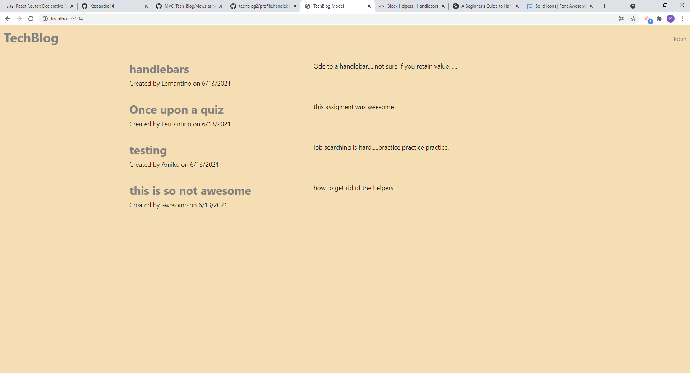

#  Sample Tech Blog - using MVC format

## Description

This is a blog site application that uses npm packages express, sequelize and handlebars to generate MVC structure. It also includes session authorization and rudimentary security.

## Screenshot

## Links

* Deployed Application : 
* Heroku: ?
* GitHub repository URL:  https://github.com/Kassandra14/TechBlog3

